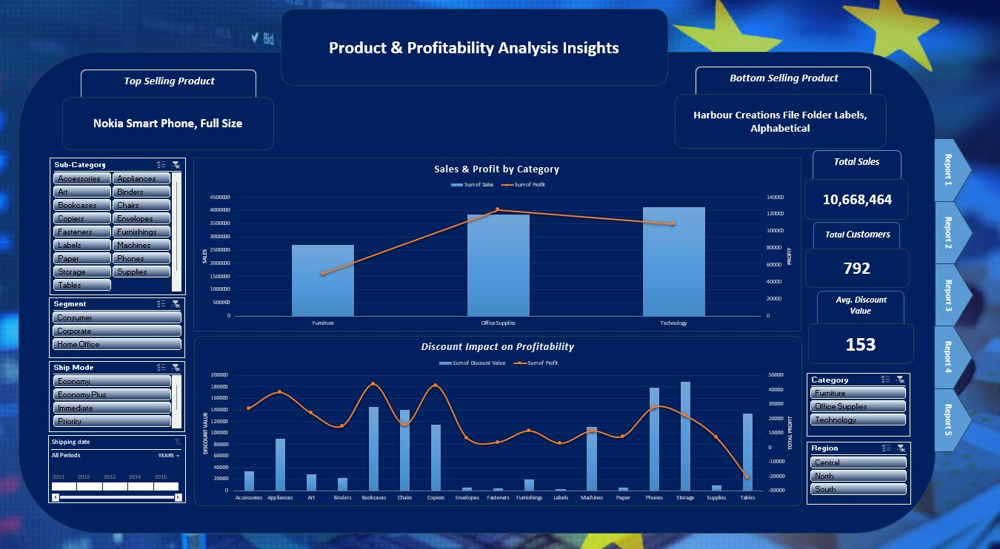
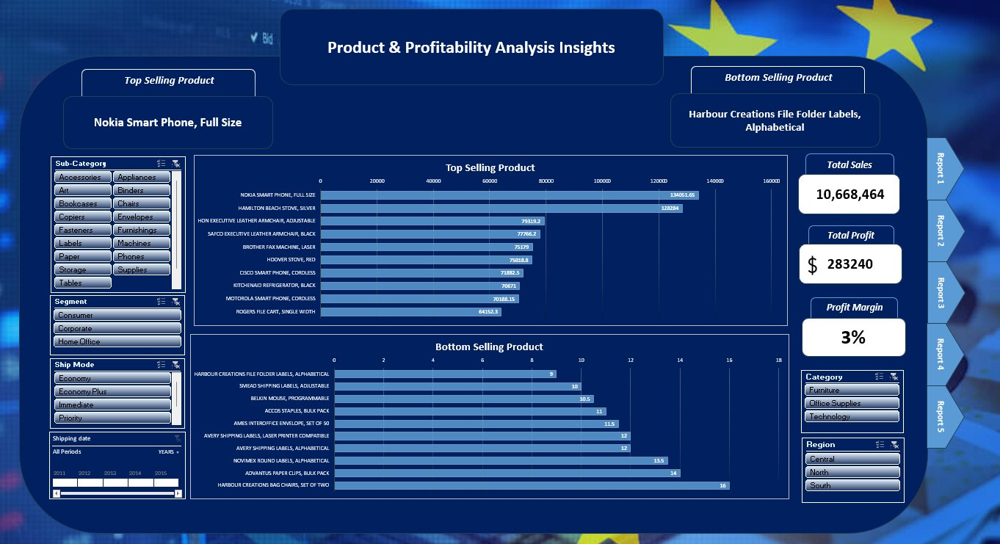
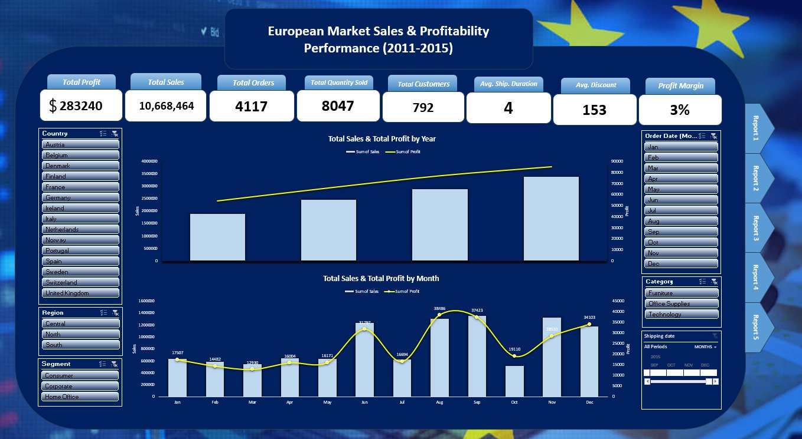
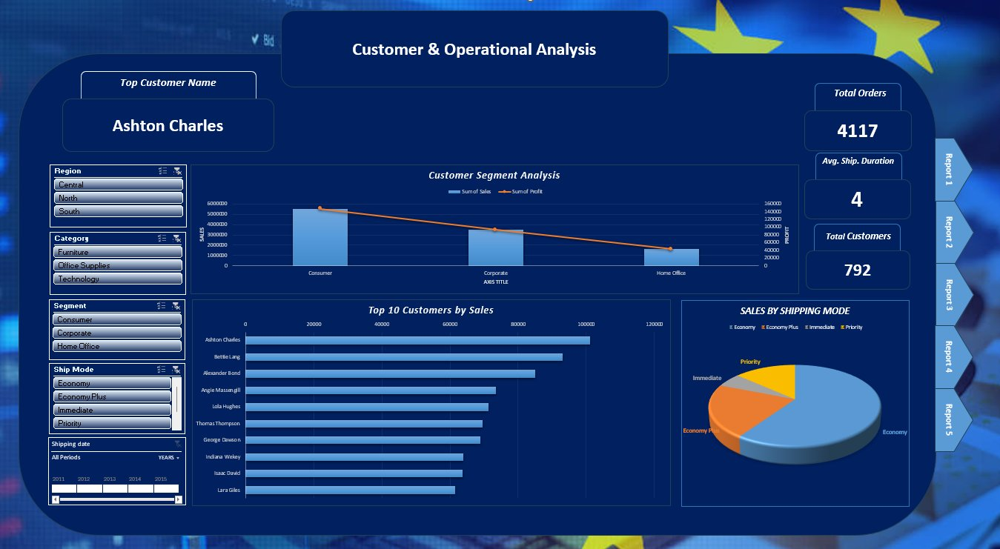
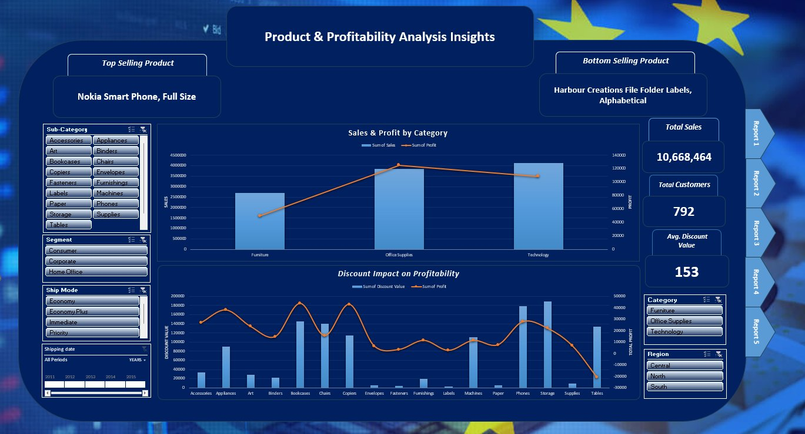

# 🌍 European Market Sales & Profitability Suite

---

## 📌 Project Overview

An interactive **multi-page Excel dashboard** designed to analyze the performance of a retail business across the **European market from 2011 to 2015**. The project focuses on identifying profitability drivers, product performance, and customer behavior.

---

## 🎯 Objective

Developed a comprehensive **5-report analytics suite** to monitor European sales operations, covering **$10.6M in total revenue**, and delivering actionable insights for pricing strategy, operational efficiency, and customer segmentation.

---

## 📊 Key Features & Insights

| Report Page | Focus Area | Key Insight |
|---|---|---|
| **Executive Summary** | KPI Overview | $10.6M Sales · $283K Profit · 3% Margin |
| **Product Performance** | Top & Low Performers | Nokia Smart Phone = #1 Seller |
| **Operational Analysis** | Shipping Efficiency | Avg. shipping duration: 4 days |
| **Profitability vs. Discount** | Pricing Strategy | High discounts on *Tables* = negative profit |
| **Customer Segmentation** | Revenue by Segment | Consumer segment = primary revenue driver |

---

## 📸 Dashboard Screenshots

### Report 1 — Executive Summary & KPIs

### Report 2 — Product Performance (Top & Bottom Sellers)

### Report 3 — Sales & Profit Trends (2011–2015)

### Report 4 — Customer & Operational Analysis

### Report 5 — Discount Impact on Profitability

---

## 🏆 Key Achievement

> **Identified a negative correlation** between high discount rates and profitability in the **"Tables"** sub-category — providing direct, actionable recommendations for the company's pricing strategy.

---

## 📈 Visuals & Techniques

- **Waterfall Charts** — Profit breakdown by category
- **Dual-Axis Charts** — Sales vs. Profit trends over time
- **Interactive Slicers** — Regional and temporal filtering
- **KPI Cards** — Real-time tracking of core business metrics
- **Bar & Donut Charts** — Customer segment and shipping mode distribution

---

## 🛠️ Tech Stack

- **Microsoft Excel** — Data Visualization & Interactive Dashboarding
- **Power Query** — Data Cleaning & ETL (European regional data handling)
- **Pivot Tables & Pivot Charts** — Dynamic data summarization and charting
- **Advanced Excel Formulas** — Complex calculations including:
  - Profit Margin %
  - Average Discount Rate
  - Year-over-Year (YoY) Growth
  - Running Totals & Cumulative Sales

---

## 📂 Dataset

- **Period Covered:** 2011 – 2015
- **Market:** Europe (multi-country retail)
- **Records:** Retail transactions across multiple product categories and customer segments

---

## 🚀 How to Use

1. Download the `.xlsx` file from this repository
2. Open it in **Microsoft Excel** (2016 or later recommended)
3. Use the slicers and dropdowns on each sheet to filter by country, year, segment, or category
4. Navigate between dashboard pages using the sheet tabs at the bottom
5. 📸 See the `screenshots` folder for a preview of all dashboard pages

---

## 👩‍💼 Author

**Hayam Medhat Wahdan** — BI & Data Specialist

---

*Part of a data portfolio showcasing end-to-end BI solutions across sales analytics, ETL automation, and business intelligence strategy.*
